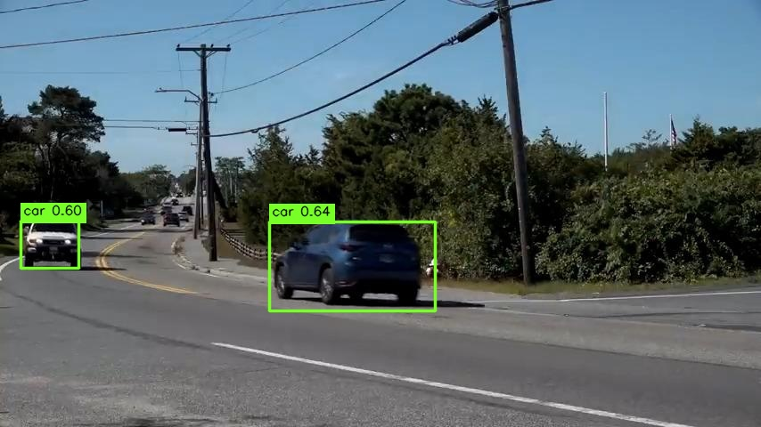
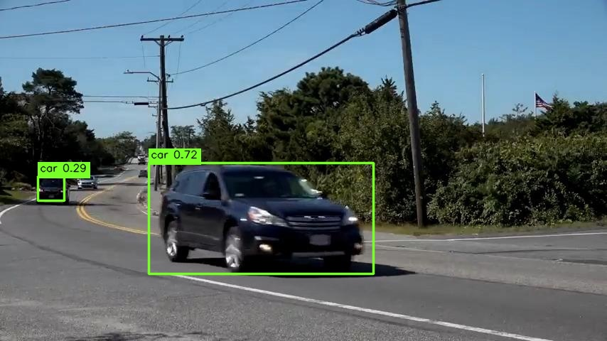
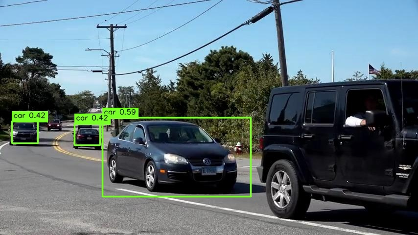
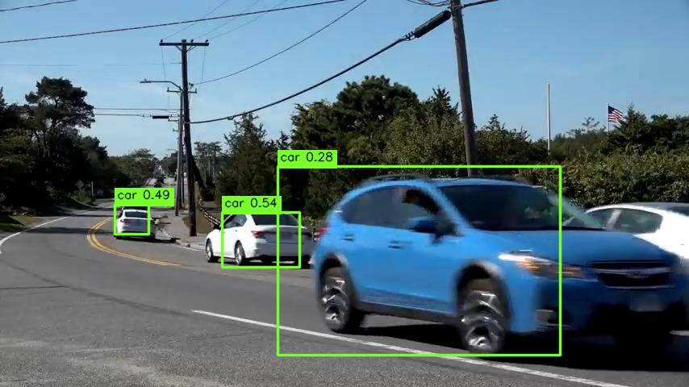

# ShitOnlyLookOnce

SOLO is a small, self-contained object-detection playground. It started as a hand-built "image to weights" experiment, and now includes two detection paths:

- **Recommended:** a compact PyTorch neural detector with FPN/PAN-style feature fusion, center offsets, quality scoring, and continuous box regression.
- **Experimental:** a pure OpenCV + Taichi detector that uses handcrafted crop features, dynamic anchors, hard negatives, edge snapping, and post-processing fusion.

The project is intentionally hackable. It is useful for trying detector ideas, debugging box geometry, and running small local datasets without pulling in a full YOLO/Ultralytics training stack.

## Current Status

The neural path is the usable one right now. The Taichi path remains research code: it is fast enough to experiment with, but it still over-fuses dense scenes and is not competitive on the current datasets.

| Dataset / split | Model | Precision | Recall | F1 |
| --- | --- | ---: | ---: | ---: |
| auto / test | `fpn_quality_v2` | 0.9000 | 0.9474 | 0.9231 |
| auto / test | `fpn_quality_v4` | 0.8824 | 0.7895 | 0.8333 |
| datasetv3 / val | `fpn_quality_v4` | 0.9332 | 0.8264 | 0.8766 |
| auto / test | Taichi fusion-fix v2 | 0.3750 | 0.1579 | 0.2222 |
| datasetv3 / val | Taichi fusion-fix v2 | 0.0000 | 0.0000 | 0.0000 |

## Example Detections

These examples use `fpn_quality_v4` drawn outputs from the `auto` dataset validation and test splits.

| Validation | Test |
| --- | --- |
|  |  |
|  |  |

## What Is Inside

```text
solo/
  cli.py                    command-line interface
  config.py                 defaults and validation
  core/                     classic SOLO feature and proposal utilities
  data/                     dataset loading, annotation parsing, weights I/O
  engine/                   classic proposal detector, evaluation, mining
  neural/                   compact PyTorch detector and training loop
  taichi_detector/          OpenCV + Taichi handcrafted detector experiment
  utils/                    bbox, OpenCV image shim, visualization
tests/                      unit and regression tests
main.py                     CLI entry point
solo.py                     compatibility wrapper
```

## Installation

```bash
git clone https://github.com/Vesflux/ShitOnlyLookOnce.git
cd ShitOnlyLookOnce
python -m pip install -r requirements.txt
```

On the development machine used for the current runs:

```bash
conda activate crab_env
python -m pytest
```

## Dataset Layout

The main training commands expect YOLO-style labels:

```text
dataset/
  train/
    images/
    labels/
  valid/
    images/
    labels/
  test/
    images/
    labels/
  classes.txt
```

Each label file uses standard YOLO format:

```text
class_id center_x center_y width height
```

Coordinates are normalized to `0..1`.

## Recommended Neural Training

Train `fpn_quality_v4`:

```bash
python solo.py dataset/train/images \
  --train-neural \
  --labels-dir dataset/train/labels \
  --calibrate-val-images dataset/valid/images \
  --calibrate-val-labels dataset/valid/labels \
  --class-names dataset/classes.txt \
  --neural-model fpn_quality_v4 \
  --neural-image-size 640 \
  --neural-epochs 30 \
  --neural-batch-size 4 \
  --workers 2 \
  --neural-device cuda \
  --score-threshold 0.18 \
  --nms-threshold 0.42 \
  --val-match-iou 0.30 \
  --max-detections 80 \
  --draw-dir outputs/valid_drawn_fpn_quality_v4 \
  --output outputs/valid_report_fpn_quality_v4.json \
  --save outputs/fpn_quality_v4_640.pt \
  --neural-soft-nms-mode auto
```

Evaluate on a test split:

```bash
python solo.py dataset/test/images \
  --backend neural \
  --detect outputs/fpn_quality_v4_640.pt \
  --neural-device cuda \
  --neural-image-size 640 \
  --score-threshold -1 \
  --nms-threshold -1 \
  --neural-max-candidates 300 \
  --max-detections 80 \
  --eval-labels dataset/test/labels \
  --annotations yolo \
  --class-names dataset/classes.txt \
  --val-match-iou 0.30 \
  --draw-dir outputs/test_drawn_fpn_quality_v4 \
  --output outputs/test_report_fpn_quality_v4.json \
  --neural-soft-nms-mode auto
```

## Neural Detector Notes

`fpn_quality_v4` includes:

- FPN-style top-down fusion and PAN-style bottom-up refinement.
- Anchor-free center/grid predictions.
- Center offset regression.
- Continuous `l/t/r/b` box regression.
- Quality scoring.
- Task-aligned classification/localization training.
- Smooth L1, GIoU, CIoU, MPDIoU, and NWD-inspired geometry losses.

The earlier `fpn_quality_v2` is still a strong baseline on the small auto dataset. Keep both around when comparing changes.

## Experimental Taichi Detector

The Taichi detector is kept because it is useful for studying old-school geometry problems:

- dynamic multi-scale anchors
- OpenCV feature planes
- handcrafted crop statistics
- hard-negative mining
- DIoU/NMS experiments
- distance-based box fusion
- edge-based bbox snapping
- small-object soft matching

Train it like this:

```bash
python solo.py dataset/train/images \
  --train-taichi \
  --labels-dir dataset/train/labels \
  --calibrate-val-images dataset/valid/images \
  --calibrate-val-labels dataset/valid/labels \
  --taichi-backend auto \
  --taichi-feature-backend opencv \
  --taichi-epochs 280 \
  --taichi-hidden-size 18 \
  --taichi-hard-negative-rounds 1 \
  --taichi-negatives-per-image 140 \
  --taichi-positive-jitter 7 \
  --taichi-anchor-stride-ratio 0.50 \
  --score-threshold 0.88 \
  --nms-threshold 0.28 \
  --max-detections 80 \
  --draw-dir outputs/taichi_valid_drawn \
  --output outputs/taichi_valid_report.json \
  --save outputs/taichi_detector.json
```

Known limitation: this path still over-fuses dense scenes and can produce boxes that do not match target centers. Treat its metrics as diagnostic, not production quality.

## Testing

```bash
python -m pytest
```

Current local result:

```text
43 passed
```

## Development Notes

- The code uses OpenCV for image I/O and transforms.
- `outputs/`, generated weights, logs, and local datasets are ignored by Git.
- README images are copied into `docs/assets/readme/` so GitHub can render them.
- Prefer reporting precision, recall, F1, TP, FP, and FN together; a single score hides too much.

## License

No license has been declared yet.
